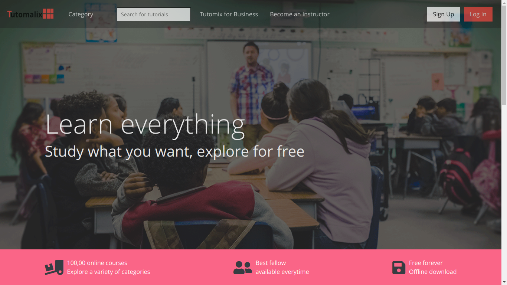

## Education Application
Implementation of CodeLn Frontend assessment mockup made with Adobe XD tool.

### How to Run/Preview
* Clone this repo 
```git clone https://github.com/ionware/codeln_fe```
* change directory into the cloned repo folder and install dev dependencies by running 
```npm 
cd codeln_fe && npm install
```
* Finally, compile all assets and start the server by running
```npm
npm start
``` 
You can navigate to the local server created by live-server in your browser.
### Things I used
1. [Bootstrap 4](https://getbootstrap.com)
2. [Font Awesome](https://fontawesome.com)
3. SCSS/SASS
4. Node.js
5. [jQuery](https://jquery.com)
6. [NPM](https://npmjs.org)
7. [Figma](https://figma.com)

### Credit
* Home page photo credit [@neobrand](https://unsplash.com/@neonbrand)